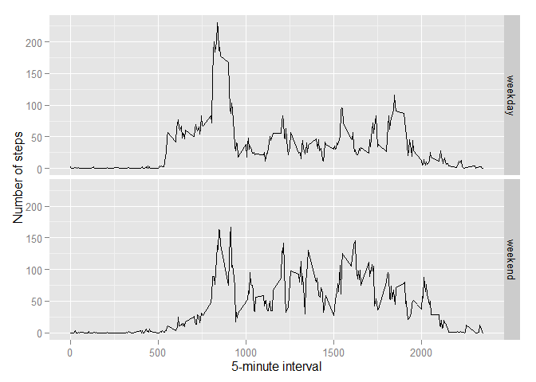

# Reproducible Research: Peer Assessment 1
Ido Lustig  

## General settings

```r
options(scipen = 1)
library(ggplot2)
```

## Loading and preprocessing the data

```r
if(!file.exists('activity.csv')){unzip('activity.zip')}

fl <- read.csv("activity.csv", na.strings="NA")
fl$date <- as.Date(fl$date)
str(fl)
```

```
## 'data.frame':	17568 obs. of  3 variables:
##  $ steps   : int  NA NA NA NA NA NA NA NA NA NA ...
##  $ date    : Date, format: "2012-10-01" "2012-10-01" ...
##  $ interval: int  0 5 10 15 20 25 30 35 40 45 ...
```

## What is mean total number of steps taken per day?  
The total number of steps taken per day:  

```r
stepsSum <- tapply(fl$steps, fl$date, FUN=sum, na.rm=T)
qplot(stepsSum, binwidth=750, main="Total number of steps taken each day", 
      xlab="Total daily steps", ylab="Frequency using binwith 750")
```

 

Mean and median of the total number of steps taken per day:  

```r
mean(stepsSum, na.rm = T)
```

```
## [1] 9354.23
```

```r
median(stepsSum, na.rm = T)
```

```
## [1] 10395
```

## What is the average daily activity pattern?

```r
stepsAvg <- aggregate(x=list(steps=fl$steps), by=list(interval=fl$interval), 
                      FUN=mean, na.rm=TRUE)
ggplot(data=stepsAvg, aes(x=interval, y=steps)) +
        geom_line() +
        xlab("5-minute interval") +
        ylab("Average number of steps taken")
```

 

Which 5-minute interval, on average across all the days in the dataset, 
contains the maximum number of steps?  

```r
stepsAvg[which.max(stepsAvg$steps),]
```

```
##     interval    steps
## 104      835 206.1698
```

## Imputing missing values
Number of missing values in the dataset:  

```r
missingVals <- is.na(fl)
sum(missingVals[missingVals==T])
```

```
## [1] 2304
```

Use the mean for that 5-minute interval to fill each NA value in the steps 
column:  

```r
newfl <- fl 
for (i in 1:nrow(newfl)) {
    if (is.na(newfl$steps[i])) {
        newfl$steps[i] <- stepsAvg[which(newfl$interval[i] == 
                                                 stepsAvg$interval), 2]
    }
}
```

The impact of missing values - nulls, mean, median

```r
newStepsSum <- tapply(newfl$steps, fl$date, FUN=sum, na.rm=T)
comp <- c(sum(is.na(fl)), sum(is.na(newfl)), mean(stepsSum, na.rm = T), 
          mean(newStepsSum, na.rm = T), median(stepsSum, na.rm = T), 
          median(newStepsSum, na.rm = T))
dim(comp)<-c(2,3)
rownames(comp) <-c("original", "new") 
colnames(comp) <- c("nulls", "mean", "median")
comp
```

```
##          nulls     mean   median
## original  2304  9354.23 10395.00
## new          0 10766.19 10766.19
```

Show a histogram of the total number of steps taken each day (new dataset)

```r
newStepsSum <- tapply(newfl$steps, newfl$date, FUN=sum, na.rm=T)
qplot(newStepsSum, binwidth=750, main="Total number of steps taken each day", 
      xlab="Total daily steps", ylab="Frequency using binwith 750")
```

 

## Are there differences in activity patterns between weekdays and weekends?
Create a new factor variable in the dataset with two levels - "weekday" and 
"weekend"  

```r
newfl$weekdays <- factor(format(newfl$date, "%A"))
levels(newfl$weekdays) <- list(weekday = c("Monday", "Tuesday", "Wednesday",
                                           "Thursday", "Friday"),
                                 weekend = c("Saturday", "Sunday"))
table(newfl$weekdays)
```

```
## 
## weekday weekend 
##   12960    4608
```

Make a panel plot containing a time series plot of the 5-minute interval (x-axis) 
and the average number of steps taken, averaged across all weekday days or weekend 
days (y-axis)  


```r
averages <- aggregate(steps ~ interval + weekdays, data=newfl, mean)
ggplot(averages, aes(interval, steps)) + geom_line() + facet_grid(weekdays ~ .) +
    xlab("5-minute interval") + ylab("Number of steps")
```

 
